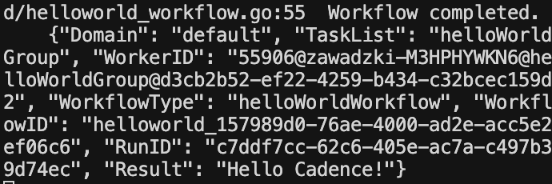
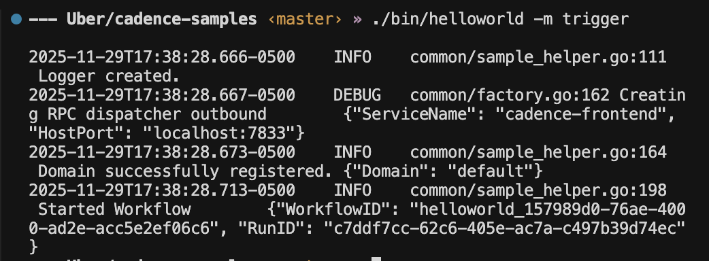
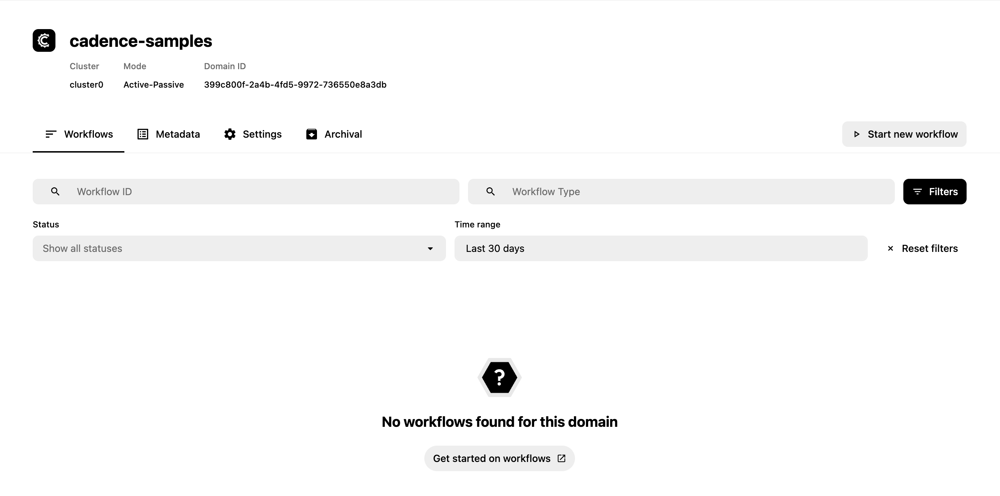
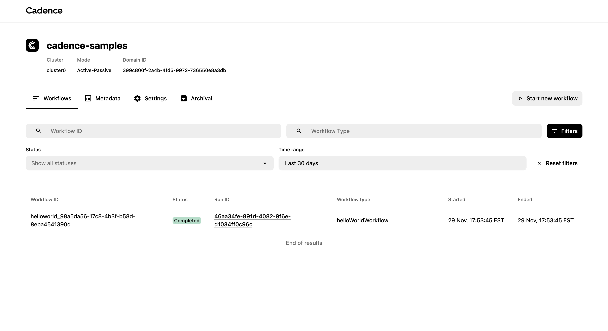
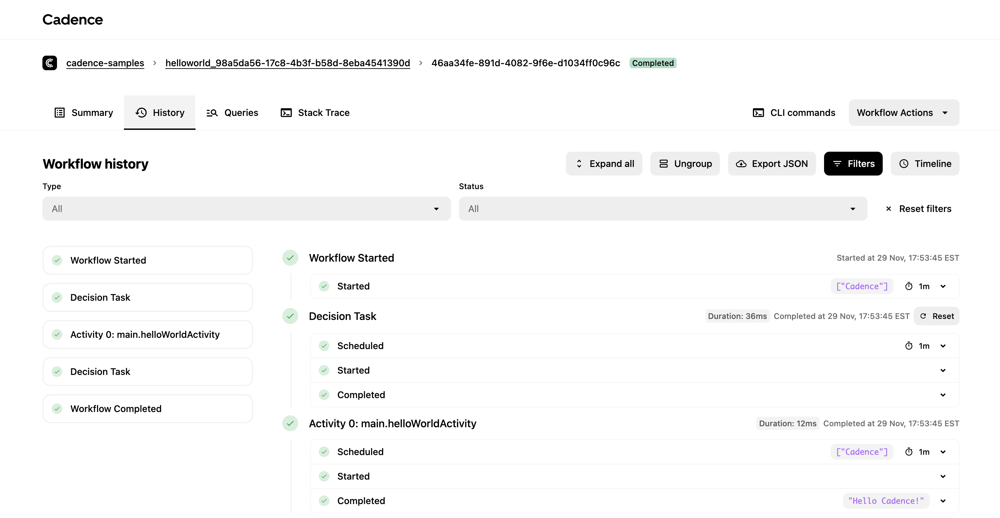
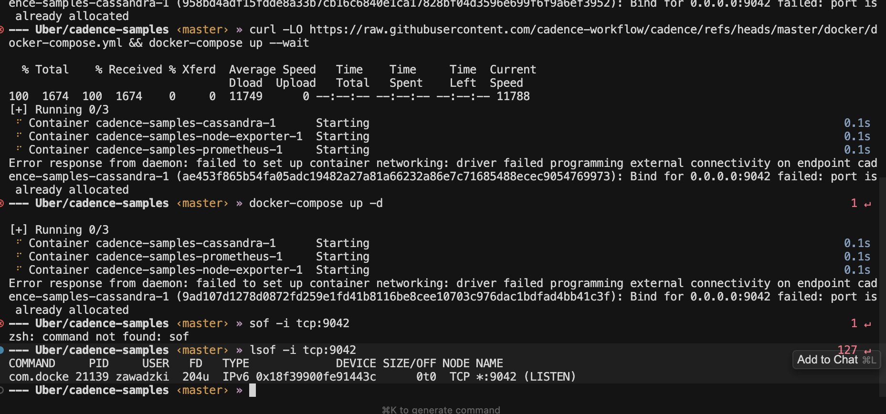

<!-- THIS IS A GENERATED FILE -->
<!-- PLEASE DO NOT EDIT -->

# Hello World Sample

## Prerequisites

0. Install Cadence CLI. See instruction [here](https://cadenceworkflow.io/docs/cli/).
1. Run the Cadence server:
    1. Clone the [Cadence](https://github.com/cadence-workflow/cadence) repository if you haven't done already: `git clone https://github.com/cadence-workflow/cadence.git`
    2. Run `docker compose -f docker/docker-compose.yml up` to start Cadence server
    3. See more details at https://github.com/uber/cadence/blob/master/README.md
2. Once everything is up and running in Docker, open [localhost:8088](localhost:8088) to view Cadence UI.
3. Register the `cadence-samples` domain:

```bash
cadence --env development --domain cadence-samples domain register
```

Refresh the [domains page](http://localhost:8088/domains) from step 2 to verify `cadence-samples` is registered.

## Steps to run sample

Inside the folder this sample is defined, run the following command:

```bash
go run .
```

This will call the main function in main.go which starts the worker, which will be execute the sample workflow code

### Start your workflow

This workflow takes an input message and greet you as response. Try the following CLI

```bash
cadence --env development \
  --domain cadence-samples \
  workflow start \
  --workflow_type cadence_samples.HelloWorldWorkflow \
  --tl cadence-samples-worker \
  --et 60 \
  --input '{"message":"Cadence"}'
```

You should see output like this:



And the worker will log the completed workflow:



Here are the details to this command:

* `--domain` option describes under which domain to run this workflow
* `--env development` calls the "local" cadence server
* `--workflow_type` option describes which workflow to execute
* `-tl` (or `--tasklist`) tells cadence-server which tasklist to schedule tasks with. This is the same tasklist the worker polls tasks from. See worker.go
* `--et` (or `--execution_timeout`) tells cadence server how long to wait until timing out the workflow
* `--input` is the input to your workflow

To see more options run `cadence --help`

### View your workflow

#### Cadence UI (cadence-web)

Click on `cadence-samples` domain in cadence-web to view your workflow.



Click on the workflow to see details:

* In Summary tab, you will see the input and output to your workflow



* Click on History tab to see individual steps. Expand an activity to see its result:



* In Summary tab, you will see the input and output to your workflow
* Click on History tab to see individual steps.

#### CLI

List workflows using the following command:

```bash
cadence --env development --domain cadence-samples workflow list
```

You can view an individual workflow by using the following command:

```bash
cadence --env development \
  --domain cadence-samples \
  workflow describe \
  --wid <workflow_id>
```

* `workflow` is the noun to run commands within workflow scope
* `describe` is the verb to return the summary of the workflow
* `--wid` (or `--workflow_id`) is the option to pass the workflow id. If there are multiple "run"s, it will return the latest one.
* (optional) `--rid` (or `--run_id`) is the option to pass the run id to describe a specific run, instead of the latest.

To view the entire history of the workflow, use the following command:

```bash
cadence --env development \
  --domain cadence-samples \
  workflow show \
  --wid <workflow_id>
```

## Troubleshooting

If you see port conflicts when starting Docker, use `lsof` to find what's using the port:



See the main [README](../../README.md#docker-troubleshooting) for detailed Docker troubleshooting steps.
## References

* The website: https://cadenceworkflow.io
* Cadence's server: https://github.com/uber/cadence
* Cadence's Go client: https://github.com/uber-go/cadence-client

