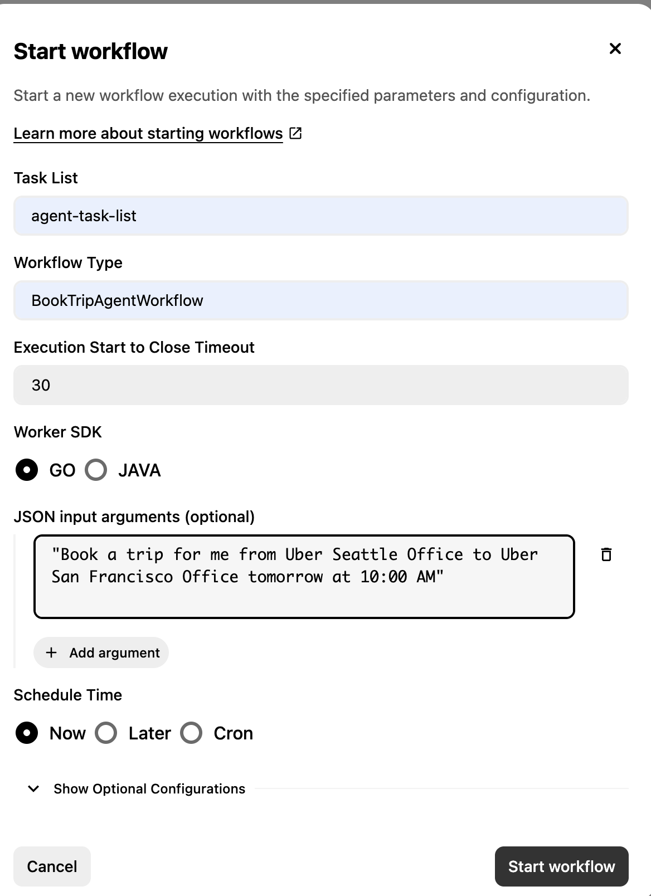
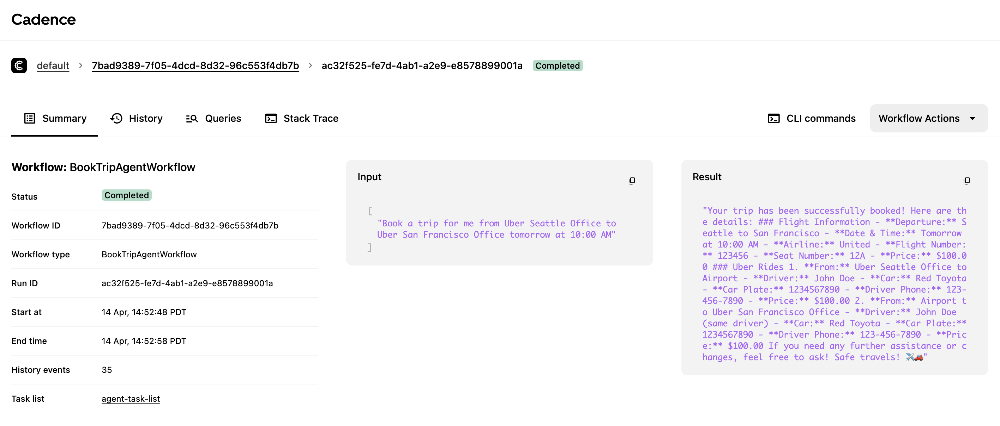

# What

This demo shows how to run OpenAI agents in a durable way (retries, reset to a check point). Specifically, we show the execution of a multi-agent system with handoffs.

# Setup OpenAI API keys

Make sure the OPENAI_API_KEY environment variable is set. See details for best practices.
https://help.openai.com/en/articles/5112595-best-practices-for-api-key-safety

# Setup Cadence Server

Refer to step 3 of the [Quick Start](../../README.md) in `python_sdk_samples/README.md` for instructions on starting the Cadence Server:

```bash
curl -LO https://raw.githubusercontent.com/cadence-workflow/cadence/refs/heads/master/docker/docker-compose.yml && docker-compose up --wait
```

# Start Agent workers

```
cd python_sdk_samples
uv sync
uv run python -m openai_samples.agent_handoffs.main
```

# Trigger Agent Run

Run Cadence CLI command

```
cadence --domain default workflow start \
--workflow_type BookTripAgentWorkflow \
--tasklist agent-task-list \
--execution_timeout 30 \
--input '"Book a trip for me from Uber Seattle Office to Uber San Francisco Office tomorrow at 10:00 AM"'
```

Or click start workflow in the [cadence-web](http://localhost:8088/domains/default/cluster0/workflows)


# View Agent Run Result


